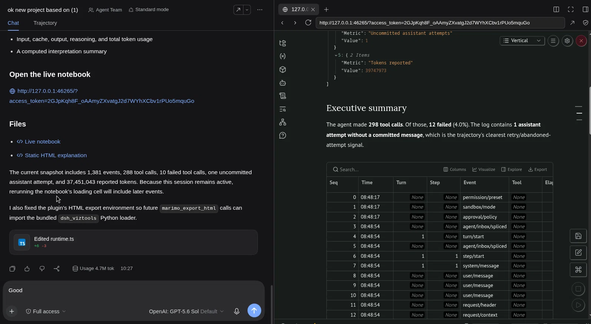

# dsh-viztools

`dsh-viztools` is an MIT-licensed DSH 0.2 plugin that runs one authenticated [marimo](https://marimo.io/) server per workspace, connects its code-mode MCP tools to the agent, and opens the live notebook beside chat.

The first version also includes a read-only Python loader for DSH `session.vN.jsonl[.zstd]` trajectories. A notebook can turn a real run into a timeline, tool-call table, retry view, token chart, and static HTML explanation.

## What it does

- Creates a uv-managed Python environment at `.dsh/marimo/.venv`.
- Pins marimo (`0.25.1` by default) and installs its MCP extras plus `zstandard`.
- Starts marimo on `127.0.0.1` using a free port and a fresh 256-bit token.
- Stops the child process when the Cordis plugin scope is disposed.
- Connects marimo through DSH's official `@deepseek-ai/dsh-mcp-client` bridge.
- Uses marimo's experimental hidden `--mcp=code-mode` mode so the agent can edit the notebook, not just inspect it.
- Sends the authenticated browser URL only through DSH's authenticated Host-to-Client route and opens the right-sidebar Browser automatically; the token never enters a model tool result.
- Registers `marimo_status`, `marimo_export_html`, and the `explain-with-notebook` and `explain-plan` skills.
- Adds `dsh_viztools.session.load_session()` to the notebook's Python path.

## Requirements

- DSH `0.2.0-rc.2` (the MVP pins its DSH peer packages to this exact release candidate).
- Node.js 22 or later.
- [`uv`](https://docs.astral.sh/uv/) 0.11.0 or newer on `PATH` (uv is the only supported Python environment manager).
- Network access on the first start so uv can provision Python and the pinned packages.
- A Web profile with the right-sidebar Browser. The bundled patch enables the shipped Browser entry.

## Install locally

Build the package, then link it into a disposable DSH profile:

```bash
pnpm install
pnpm check

dsh rescue --from-default-profile web --dump-config >/dev/null
dsh plugin --profile rescue link "$PWD"
dsh rescue
```

Use a test profile first. The plugin does not modify your active Web profile unless you explicitly install it there.

For a published package:

```bash
dsh plugin --profile rescue add dsh-viztools
dsh rescue
```

On first boot, environment setup can take a minute. Once a Session is mounted, the live notebook opens automatically in the right-sidebar Browser. `marimo_status` reports readiness and the notebook path without exposing the authentication token.

## Configuration

The bundle adds this entry:

```yaml
- id: dsh-viztools
  name: dsh-viztools
```

Override it in the profile's `cordis.patch.yml`:

```yaml
- id: dsh-viztools
  config:
    notebook: .dsh/notebooks/explanation.py
    environmentDir: .dsh/marimo
    pythonVersion: '3.12'
    marimoVersion: 0.25.1
    mcpCodeMode: true
    autoOpen: true
    exportPath: .dsh/notebooks/explanation.html
    startupTimeoutMs: 180000
```

| Setting | Default | Meaning |
|---|---|---|
| `cwd` | DSH process CWD | Workspace root. An empty value resolves to `process.cwd()` at activation. |
| `notebook` | `.dsh/notebooks/explanation.py` | Managed notebook, constrained to the workspace. |
| `environmentDir` | `.dsh/marimo` | uv environment and version marker, constrained to the workspace. |
| `uvCommand` | `uv` | uv executable name or path. |
| `pythonVersion` | `3.12` | Python version uv provisions. |
| `marimoVersion` | `0.25.1` | Exact marimo version installed. |
| `mcpCodeMode` | `true` | Enable marimo's experimental code-editing MCP tools. |
| `autoOpen` | `true` | Open marimo automatically for each mounted Session through the authenticated Client route. |
| `exportPath` | `.dsh/notebooks/explanation.html` | Default static export destination. |
| `startupTimeoutMs` | `180000` | Setup and readiness timeout. |

The notebook, environment, and export path are rejected if they lexically escape the workspace. The notebook parent is also checked after symlink resolution before marimo starts.

### Offline uv provisioning

The Python environment installs from the hashed [requirements lock](python/requirements.lock). Prepare a transferable uv cache on a connected build machine:

```bash
pnpm run wheelhouse -- dist/offline
```

The script fills `dist/offline/uv-cache`, removes its verification environment, and proves a second clean installation succeeds with `UV_OFFLINE=1` and hash checking enabled. Transfer that cache—and uv itself—to the bench PC or bake both into the Podman image.

```yaml
- id: dsh-viztools-runtime
  config:
    uv:
      command: uv
      minVersion: 0.11.0
      offline: true
      cacheDir: .dsh/offline/uv-cache
      pythonInstallDir: .dsh/offline/python
      requirements: python/requirements.lock
      requireHashes: true
      # Optional alternatives:
      # findLinks: .dsh/offline/wheels
      # indexUrl: https://internal.example/simple
```

For a Podman bundle, copy uv, the verified cache, `python/requirements.lock`, and (when uv manages Python) the populated Python install directory into the image. Configure matching `cacheDir` and `pythonInstallDir`, set `offline: true`, and start once during image validation. A disconnected bench machine then performs no PyPI access.

Changing any uv setting changes the runtime marker and forces deterministic reprovisioning. Startup fails clearly when uv is missing or older than `minVersion`.

### Optional plan-first gate

The enforcement entry is separate from the marimo runtime. Add it to a profile that must block execution until a plan is approved:

```yaml
- id: dsh-viztools-gate
  name: dsh-viztools/gate
  config:
    planFirst:
      enabled: true
      planningTools: [bench_status, describe_profile, parse_snoop, get_messages]
      denialMessage: Plan not approved yet.
```

New and unapproved resumed sessions enter plan mode. Before a positive `exit_plan_mode` review, only the configured planning tools and `exit_plan_mode` may execute; every refusal is recorded durably. Approval survives resume, and forks inherit the gate state at their fork point. The entry fails agent activation if a configured planning tool is unavailable.

The gate enforces both native calls and nested PTC dispatches. Plan mode alone is not treated as authorization, so `/plan off`, a dismissed review, or **Keep planning** does not open it.

### Approved run rules

The same gate entry can enable typed, user-approved rules that only narrow the deployment's tool policy:

```yaml
- id: dsh-viztools-gate
  name: dsh-viztools/gate
  config:
    planFirst:
      enabled: true
      planningTools: [bench_status, describe_profile, parse_snoop, get_messages]
    runRules:
      enabled: true
      allowedTools: [bench_status, describe_profile, parse_snoop, get_messages, replay_tx_only, diff, finalize_run]
      maxLimits:
        replay_tx_only: 2
```

The agent calls `propose_run_rules` with structured `allow`, `deny`, `limits`, and `notes`. The plugin rejects any rule outside `allowedTools` or any limit above `maxLimits`, then asks the user to approve the complete value. Approved allow/deny and limits are enforced for native and PTC calls. Refusals and limit exhaustion are durable. Free-text notes enter the system prompt labelled **advisory; not mechanically enforced**.

`explain_plan()` exposes a `rules` table showing enforced rules, observed calls, refused calls, and advisory notes.

### Automatic reports

Enable the separate report entry to generate a trusted, per-session report without an agent skill or notebook-editing tool:

```yaml
- id: dsh-viztools-report
  name: dsh-viztools/report
  config:
    enabled: true
    triggerTools: [finalize_run, abandon_run]
    triggerOnTurnStop: false
    template: ./templates/otx-report.py  # omit for the bundled template
    templateVersion: otx-v1
    outputDir: .dsh/reports
    environmentDir: .dsh/marimo
    includeCode: false
    extraInputs:
      auditLog: runs/current/audit.jsonl
      manifest: runs/current/manifest.json
```

Before generation the plugin flushes session persistence and asks the JSONL backend for the exact current trajectory path. It writes `.dsh/reports/<session-id>/report.py`, `inputs.json`, and `report.html`; profile-supplied templates receive only structured inputs and trusted workspace paths. `--no-include-code` produces a code-free export by default.

Generation is idempotent on session, trigger sequence, and template version. Both successful and failed attempts become durable `viztools-report/change` events, so resume does not duplicate an already settled report. The bundled template summarizes session metrics, tool calls, plan evidence, and approved run rules.

### Secure automatic sidebar

When a Session appears on screen, the Client plugin requests the marimo URL from `/api/viztools/sidebar-url` and opens it with DSH's existing Browser tab. The route is protected by DSH's Host/Origin and browser-session authentication, sends `Cache-Control: no-store`, and rejects unauthenticated requests. The model-facing `marimo_status` tool returns only the notebook path, loopback port, and marimo version.

### Locked-console mode

Use `managed-readonly` only with a notebook already generated by the trusted report service:

```yaml
- id: dsh-viztools-runtime
  name: dsh-viztools/runtime
  config:
    mode: managed-readonly
    mcpCodeMode: false
    notebook: .dsh/reports/current/report.py
    managedReportRoot: .dsh/reports
    environmentDir: .dsh/marimo
```

This mode runs `marimo run`, sends no notebook source to the browser, hides detailed tracebacks, exposes no marimo MCP endpoint, and registers no model-facing marimo tools or notebook skills. The notebook must exist below `managedReportRoot`; runtime refuses to create a starter notebook.

The package exports `checkLockedProfile()` from `dsh-viztools/profile-check`. Internal profile validation should also inspect the complete composition for duplicate editable runtime entries, untrusted template paths, arbitrary code tools, and exact supported version pins. See [THREAT_MODEL.md](THREAT_MODEL.md).

## Explain a DSH session

In a notebook cell:

```python
from dsh_viztools.session import load_session

run = load_session("/path/to/session.v4.jsonl.zstd")
run.summary
```

Useful values:

- `run.header`: physical session header.
- `run.events`: complete decoded event records.
- `run.timeline`: one normalized row per event.
- `run.tool_calls`: calls paired with their results and durations.
- `run.summary`: event, turn, tool failure, retry, and token totals.
- `run.to_polars("timeline")`: optional Polars DataFrame when `polars` is installed in the notebook.

The loader supports plaintext JSONL and concatenated Zstandard frames. It never migrates or writes the source trajectory. It intentionally preserves raw records alongside normalized rows so notebook claims remain traceable.

Ask DSH to load the `explain-with-notebook` skill, point it at a trajectory, and finish by calling `marimo_export_html`.

## Example: explain a real DSH run

The screenshot below is from the first end-to-end test: the agent analyzed the DSH session that built this plugin while the live marimo notebook remained open beside the chat.



The generated report included:

- the complete durable event timeline;
- tool-call counts, failures, and the slowest completed calls;
- assistant attempts without committed messages as retry/abandonment evidence;
- input, cache-read, cache-write, output, reasoning, and total token usage;
- an executive summary computed from the trajectory rather than copied into prose.

Try it with a prompt like:

> Use `explain-with-notebook` to explain this DSH session, including a timeline, tool calls, retries, and token usage. Export the result to HTML.

Or start from the reusable [example notebook](examples/explain-session.py). Set its trajectory field to a local `session.vN.jsonl.zstd` file, then run its cells. A captured [static HTML example](examples/session-explanation.html) is also included so the result can be reviewed without starting DSH or marimo.

The counts in the screenshot are a point-in-time snapshot of an active session. Rerunning the notebook's loading cell reads the current trajectory and recomputes every table and summary.

## Explain a plan—or a Standard-mode execution

`explain-plan` prefers the exact Markdown submitted through `exit_plan_mode`, but it no longer fails when a Standard-mode session has no durable plan. It always returns the native/MCP execution inventory; comparison fields become unavailable until a user-provided or explicitly reconstructed plan is supplied. It understands ordinary `tool/call` events and nested PTC dispatches, and splits names such as `mcp__context7__search` into server `context7` and operation `search`.

```python
from dsh_viztools.session import load_session

run = load_session("/path/to/session.v4.jsonl.zstd")
plan = run.explain_plan()       # submitted plan, or execution-only evidence
# plan = run.explain_plan(0)    # select an earlier durable submission

# Fallback for a Standard-mode session:
provided = run.explain_plan(
    plan_markdown="# Project plan\n\n## Inspect\nRead the current implementation.",
    source="user-provided",     # or "reconstructed"
    boundary_seq=42,             # omit to use session start
)

plan.plan              # source, approval status, boundary, and optional Markdown
plan.phases            # headings and attribution keywords
plan.calls             # post-submission native and PTC calls
plan.tool_inventory    # counts and failures by tool
plan.mcp_inventory     # counts by MCP server and operation
plan.summary           # computed plan/execution totals
```

A useful prompt is:

> Use `explain-plan` to compare the approved plan with this session's execution. Show native and MCP tools, failures, retries, phase attribution, unmapped work, and supporting evidence. Export it to HTML.

A reusable [plan-explanation notebook](examples/explain-plan.py) is included. Its controls let you choose a submitted plan, paste a user-provided plan, or paste a reconstructed plan and optionally set the exact execution-boundary sequence.

Plan-source labels are explicit:

- **Submitted DSH plan** — durable `exit_plan_mode` evidence;
- **User-provided plan; approval not observed** — supplied text, not a recorded approval;
- **Reconstructed plan; not an approved plan** — an interpretive fallback;
- **No plan observed — execution evidence only** — tools, failures, retries, and timing remain reportable without comparison.

Evidence labels are intentionally conservative:

- **direct** means the trajectory records the call, result, order, or timing;
- **heuristic** means a call was associated with a plan phase by keyword overlap;
- **not observed** means there is not enough durable evidence for that attribution.

An unmapped call may be unplanned work or simply lack matching prose. Likewise, a phase with no mapped call is not automatically skipped: discussion and analysis can happen without a tool call.

## Security model

A marimo code-mode notebook executes arbitrary Python with the same operating-system authority as the DSH process. Treat it as shell-equivalent.

This MVP reduces accidental exposure but is **not a sandbox**:

- marimo binds only to `127.0.0.1`;
- every activation gets a random token;
- the tokenized URL is returned only by an authenticated, no-store Host route to the Client plugin and is never included in `marimo_status`;
- DSH's Browser layout may retain that URL locally, but its random token becomes useless when this plugin process stops;
- managed paths stay in the workspace;
- model tool calls still traverse DSH's normal tool policy and approval pipeline;
- the browser iframe uses DSH's existing sandbox, including `allow-same-origin` and WebSocket support.

Do not install editable mode in a locked production/OTX console. A later read-only profile should run existing notebooks without code-mode MCP and expose only read operations.

## Current limitations

- marimo's code-mode MCP flag is experimental and hidden in marimo 0.25.1; an upstream change may require a plugin update.
- Environment installation happens during plugin activation and requires network access on the first run.
- This MVP manages one notebook/server per plugin instance (normally one per workspace process).
- The trajectory loader normalizes core message/tool/token fields defensively; plugin-defined events remain available in `run.events` but may not receive specialized columns.
- Plan-phase attribution is intentionally heuristic. DSH durably records the submitted plan and tool activity, but it does not record an authoritative plan-step identifier on each later call.
- Sidebar viewing depends on DSH's Browser plugin and therefore on iframe/WebSocket compatibility in the installed DSH build.
- `polars` is not installed by default; use Python lists, marimo tables, or install it in the notebook environment.

## Roadmap

See [ROADMAP.md](ROADMAP.md) for the implementation history and remaining release gate. Version support and exact DSH peer-pin policy are documented in [COMPATIBILITY.md](COMPATIBILITY.md). Completed milestone results are recorded in [CHANGELOG.md](CHANGELOG.md). Security boundaries are in [THREAT_MODEL.md](THREAT_MODEL.md), and [SECURITY_REVIEW.md](SECURITY_REVIEW.md) lists automated evidence plus the internal checks required before v1 publication.

## Development

```bash
pnpm typecheck
pnpm test
pnpm build
pnpm pack --dry-run
```

Python loader tests run with the system Python and do not require marimo. The live smoke test provisions the uv environment and should be run explicitly against a disposable DSH profile.

## License

MIT. marimo is Apache-2.0 and is installed as a runtime dependency in the workspace-local Python environment; its source is not vendored here.
